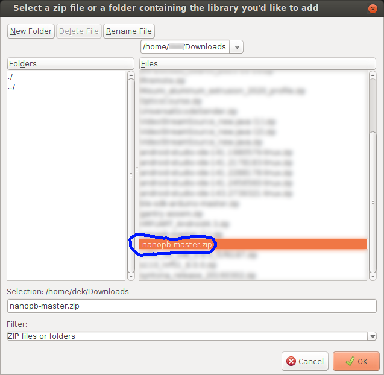
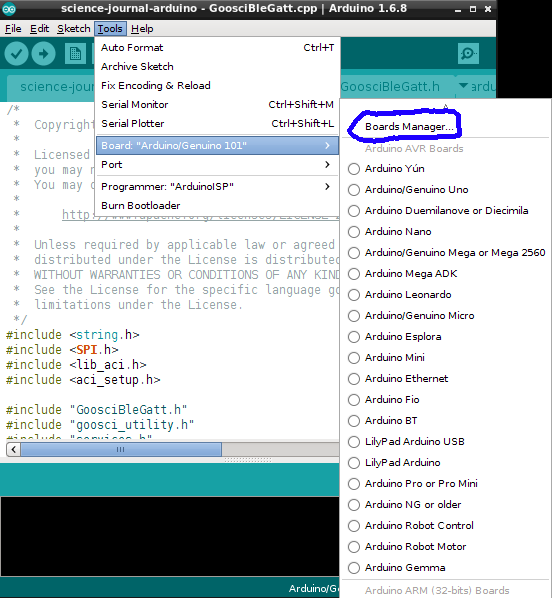
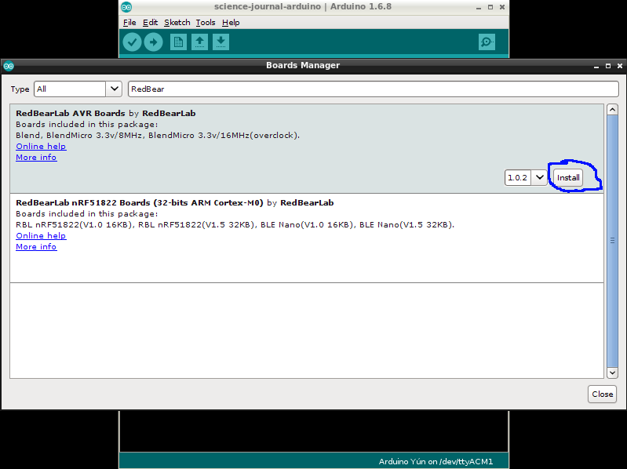
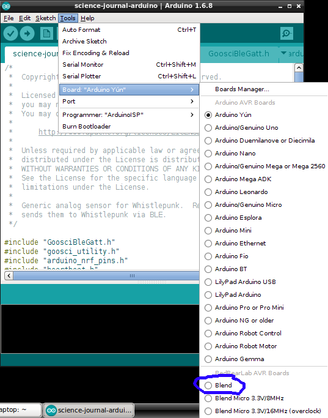
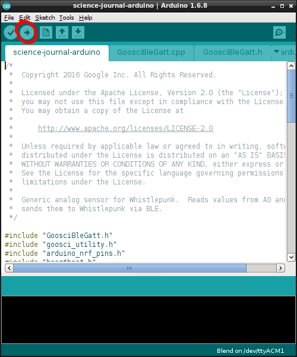

The Arduino sketch used by the Science Journal Android application.
This sketch is used to make an Arduino that has Bluetooth Low Energy
(BLE) capabilities (such as the RedBear BLEND board) send data from
its pins to Science Journal.

To build and install this sketch, 
  * [install the Arduino IDE](https://www.arduino.cc/en/Main/Software) on your desktop/laptop computer. The [Getting Started](https://www.arduino.cc/en/Guide/HomePage) page explains how to install the IDE.
  * You also need to install the nanopb support library. 
    - In your browser, open https://github.com/nanopb/nanopb.  Click the "Download ZIP" button:
      
    - Inside the Arduino IDE go to Sketch -> Include Library -> Add .ZIP Library:
      
    - Navigate to the Downloads directory for your computer's browser
      (this location differs by Operating System) and select the file
      "nanopb-master.zip".
      
  * If you are using the BLEND board, you need to add the Red Bear site to your Arduino IDE's preferences:
    - Navigate to the File->Preferences menu item
      
    - install the BLEND Device's definition to the Arduino IDE Preferences
      
    - Add the BLEND Device to the Arduino IDE Board Manager
      
    - Enter RedBear as the search term and click on the "RedBear AVR" board
      
    - Click on the "Install" button
      
    - Tell the Arduino IDE you want to program a BLEND board
      
    - Tell the Arduino IDE what port the BLEND board is on.  It will report itself as an "Arduino Leonardo"
      
    - Click the checkmark to upload the firm
      
    - When it succeeds, it will say "Done uploading"
      

You must install the following libraries
* https://github.com/RedBearLab/ble-sdk-arduino
- Follow the guide here https://github.com/RedBearLab/Blend/blob/master/Docs/LibraryManager.pdf
