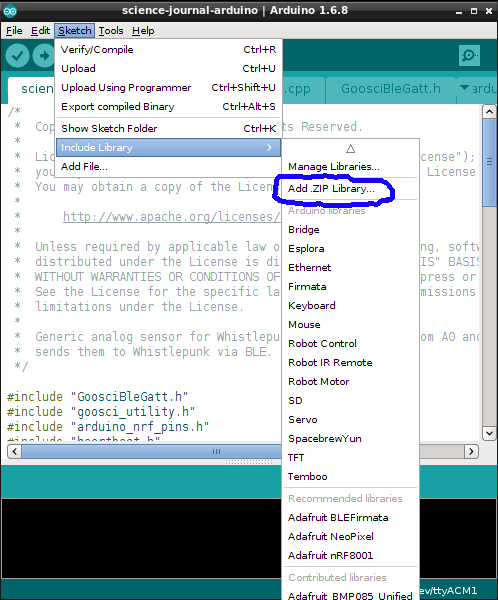

The Arduino sketch used by the Science Journal Android application.  This sketch
is used to make an Arduino that has Bluetooth Low Energy (BLE) capabilities
(such as the RedBear BLEND board and the Arduino 101) send data from its pins to
Science Journal.

To build and install this sketch, 
  * [install the Arduino IDE](https://www.arduino.cc/en/Main/Software) on your desktop/laptop computer. The [Getting Started](https://www.arduino.cc/en/Guide/HomePage) page explains how to install the IDE.
  * You also need to install the nanopb support library. 
    - In your browser, open https://github.com/nanopb/nanopb.  Click the "Download ZIP" button:
      
    - Inside the Arduino IDE go to Sketch -> Include Library -> Add .ZIP Library:
      
    - Navigate to the Downloads directory for your computer's browser
      (this location differs by Operating System) and select the file
      "nanopb-master.zip".
      
  * If you are using the BLEND board, [follow the BLEND installation instructions](docs/BLEND.md)
  * If you are using the Arduino 101 board, [follow the Arduino 101 installation instructions](docs/arduino101.md)
