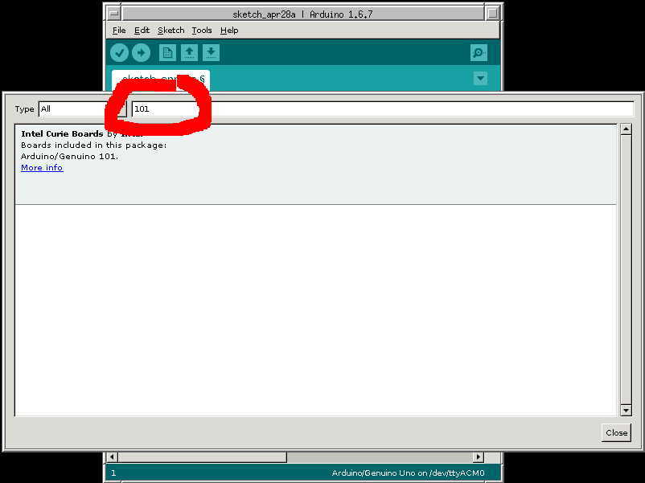
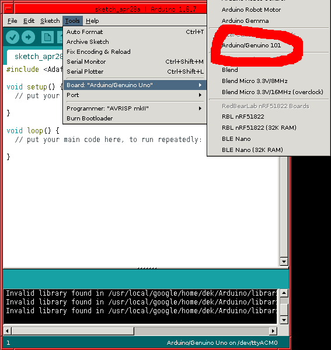
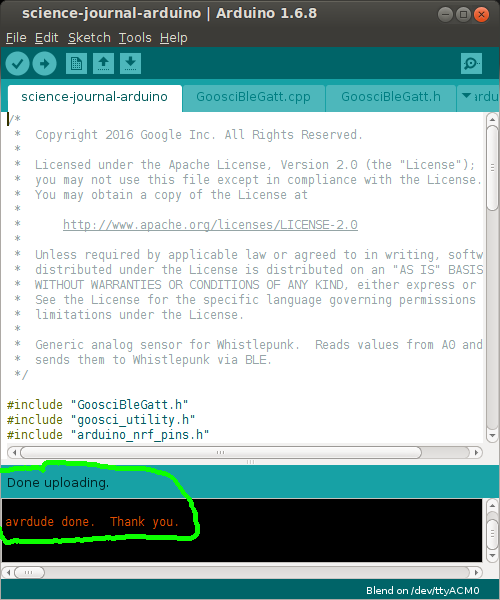

* Install support for the Arduino 101 Device
    - Add the Arduino 101 Device to the Arduino IDE Board Manager
      
    - Enter 101 as the search term and click on the "" board
      
    - Click on the "Install" button, then click close to return to the Arduino IDE.

* Program the Arduino 101 board
    - Tell the Arduino IDE you want to program a Arduino board
      
    - Tell the Arduino IDE what port the Arduino 101 board is on.  It will report itself as an "Arduino/Genuino 101"
      
    - Click the checkmark to upload the firm
      
    - When it succeeds, it will say "Done uploading"
      

