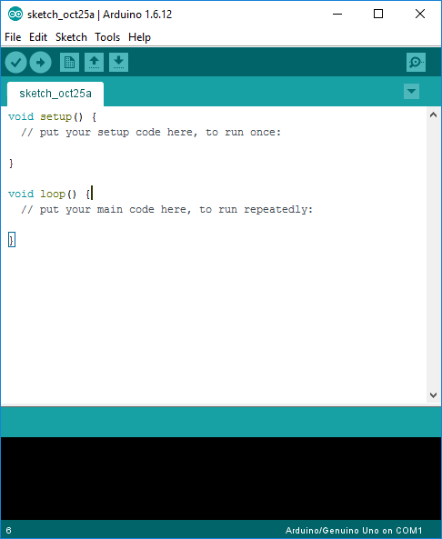
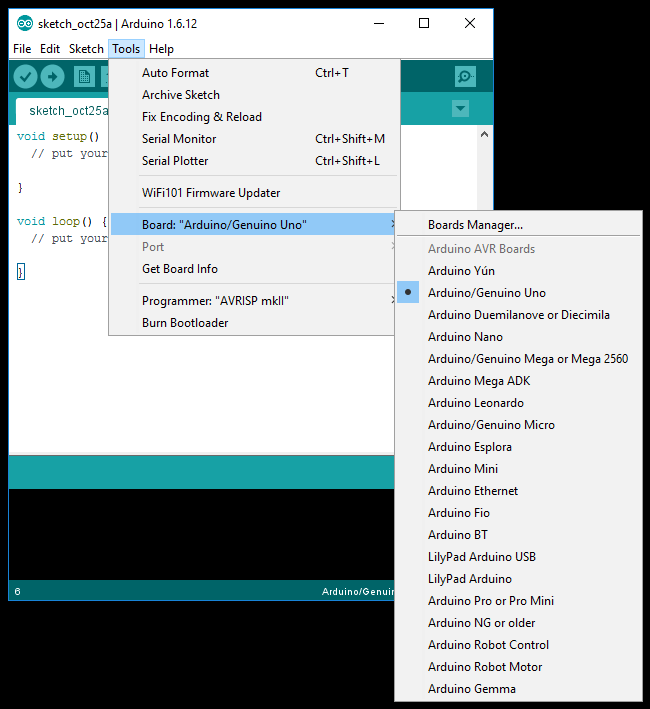
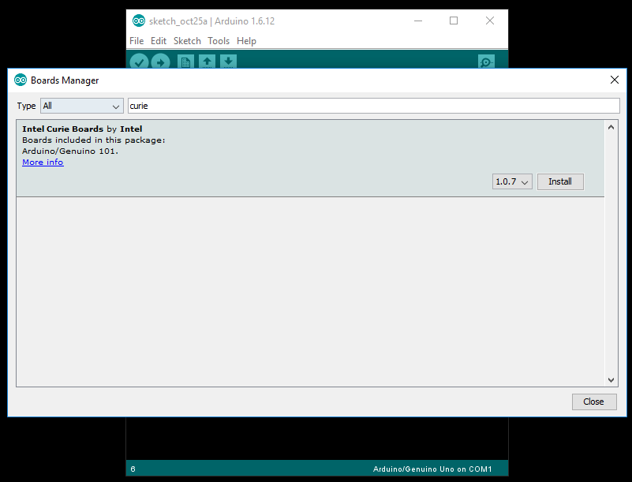
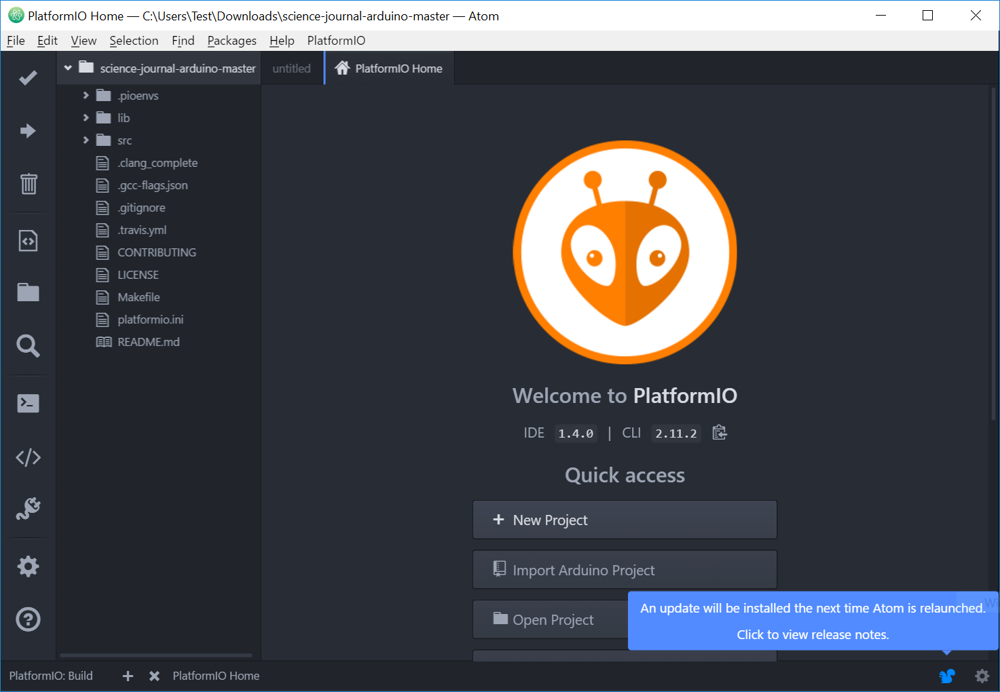
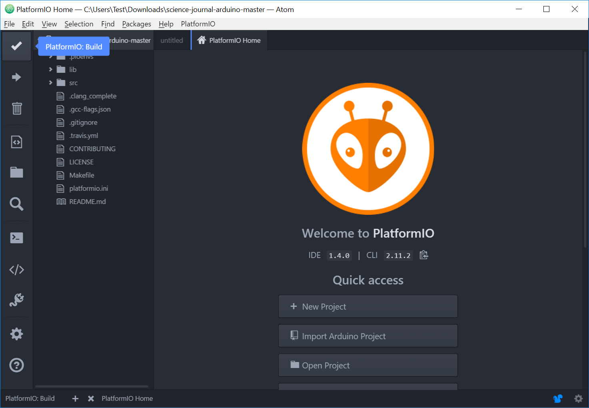
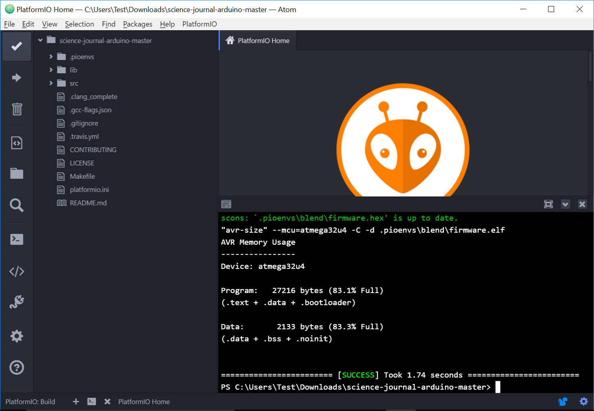
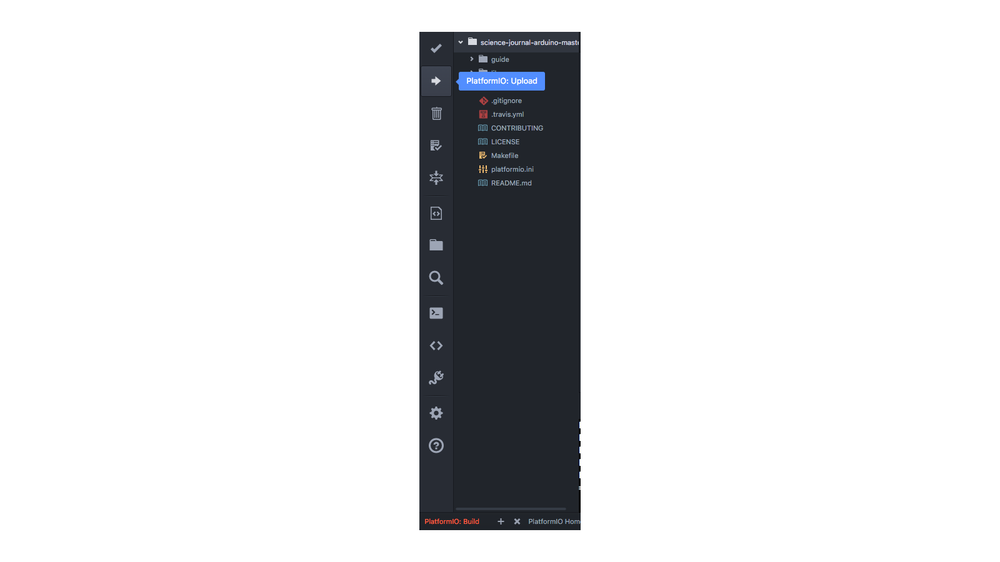
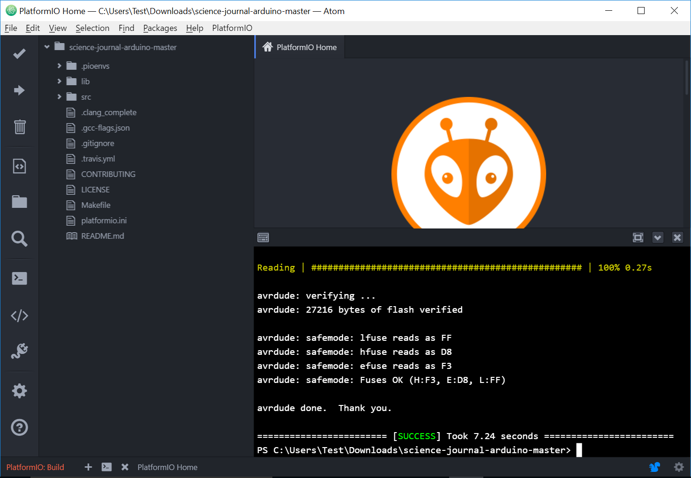

# A walkthru of the basic workflow of PlatformIO building and uploading the  Science-Journal-Arduino firmware.

**How to Flash an Arduino**

In order to get your Arduino and the Science Journal app connected via bluetooth, you will need to download a small piece of firmware onto your Arduino.

**What you need:**
Bluetooth enabled Arduino
USB cable
Computer
Internet access

**Windows Users: **
If you're on Windows and using an [Arduino 101](https://www.arduino.cc/en/Main/ArduinoBoard101), first you need to install the Arduino IDE and follow these substeps.

* Launch the IDE

* Load the Boards Manager via Tools -> Board: ... -> Boards Manager...

* Install the Intel Curie boards files and drivers by searching for "curie" and clicking install. During the install you will be asked to authorize installation of a few packages, approve them.

* Once completed

***

**All Other users start here:**

How to:

1. **Download PlatformIO IDE and install on your computer.**
You will need a free piece of software called PlatformIO IDE. You can download this [here](http://platformio.org/get-started). Note, if you have a Mac, you will be downloading this outside the App store so you might need to [enable third party developer access](https://support.apple.com/kb/PH21769?locale=en_US) to open.
2. **Download the Science Journal firmware [Science Journal firmware](https://github.com/google/science-journal-arduino)  from GitHub.**
This will download as a zip file. You can do this by clicking “clone or download” and selecting “download zip.” When downloaded, unzip the file so you see a folder titled “science-journal-arduino-master”.

3. **Connect your Arduino to your computer via the usb cable. **
4. **Launch PlatformIO IDE.**
You should see a home screen that looks something like this:

5. **Select “Open Project” and open your newly unzipped folder “science-journal-arduino-master”.**
When the project has loaded, your screen should look something like this:

6. **Click on the checkmark in the top left corner of the app to begin the firmware compilation.**
Compilation can take a couple minutes.

7. When it has finished, you should see something like this for a little bit and then be returned to the project screen.

8. **Click the upload button to upload to the arduino.**

9. **Select Serial Monitor (plug icon) and set the port and baud rate.**
Look for the port with Arduino in the title. Select a baud rate that is right for your connection. If you are connecting via a standard usb, select 115200.

10. **Record your arduino’s longname on the back of the board. **
The longname is the id that science journal will register when connecting to it via bluetooth.

Now you are ready to connect your arduino to science journal!

***

**Troubleshooting:**

If you are having trouble with the upload process, you can attempt a manual upload via the terminal window.

**Launch the terminal by clicking on the terminal icon.**

**Manually Upload the firmware to your device. **
Copy and paste the following to the terminal line:

	pio run -e <ENV> --target upload

Depending on what arduino you are using, you must replace the <ENV> with the correct board specification.

For example, if you are using an Arduino 101, your script should look like:

	pio run -e 101 --target upload

Other available environments are blend, uno, mega2560

Remember, punctuation, spacing, and spelling are critical when entering something into the terminal. If you get an error message, check to see if you made a typo.

When you are done, you should see a screen that looks like this:

