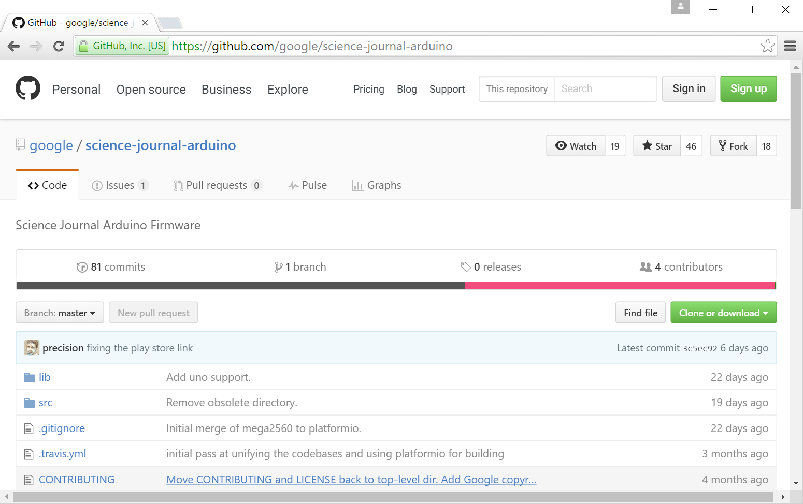
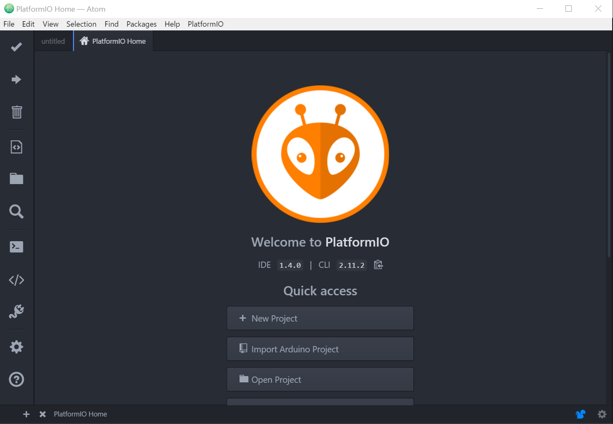
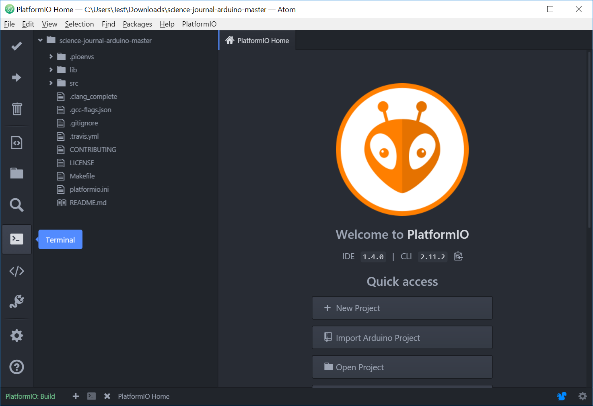
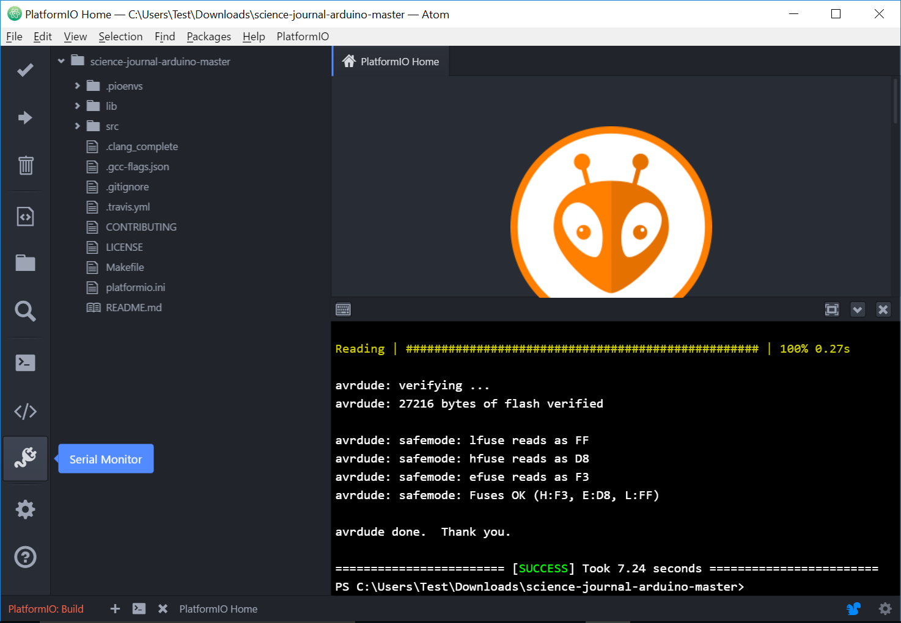
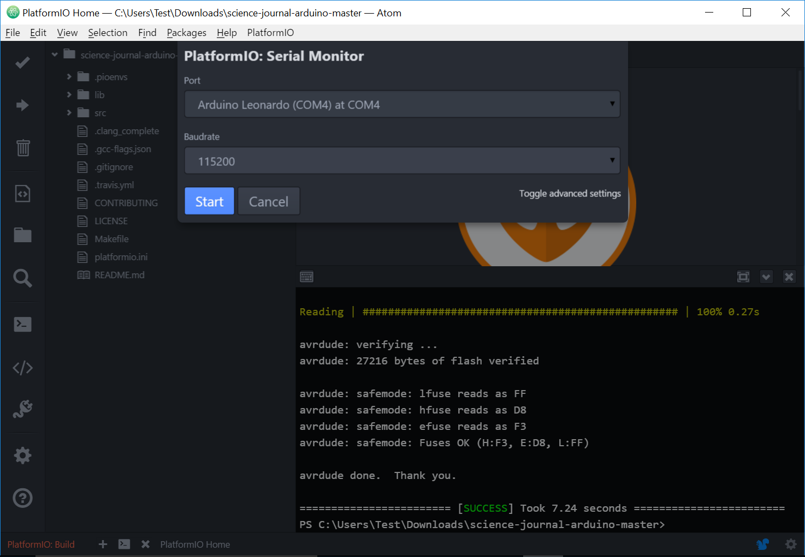
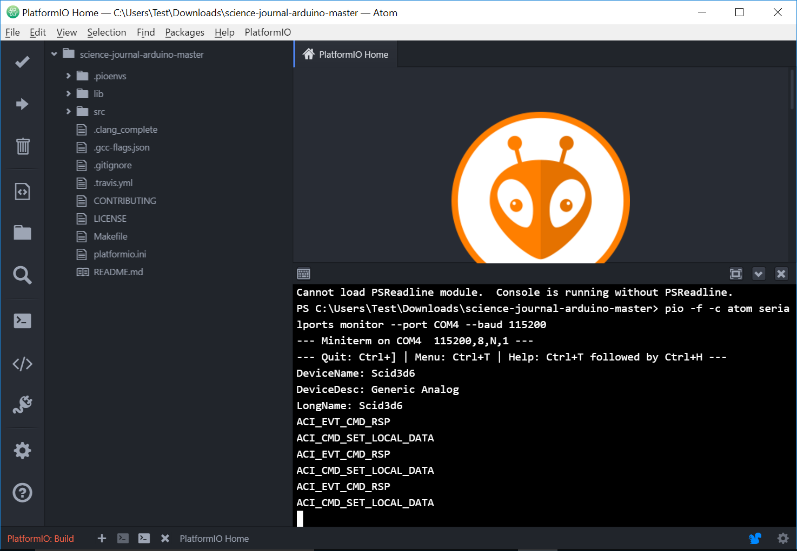

# A walkthru of the basic workflow of PlatformIO building and uploading the  Science-Journal-Arduino firmware.

* Download the [Arduino Firmware](http://github.com/google/science-journal-arduino) via the green "**Clone or download**" button on the right hand side.

* Once downloaded, unzip using your favorite tool if needed.

* Download and install [PlatformIO](http://www.platformio.org) for your OS.  After installation you should be greeted with the Home screen.
 

* From this screen select "Import Arduino Project" and select the path to your checkout.  After a few seconds you should be greeted with a screen like below.

* Click the checkmark on the lefthand side to build the firmwares.

	PlatformIO should automatically install all the required compiler toolchains and libraries.

	If everything has worked according to plan you should see something like this for a little bit and then be returned to the project screen.

* Now launch the built in **Terminal**

* From the terminal upload the firmware to your device.  You need to specify which board you are using.  The current supported board environment identifiers are [arduino101](https://www.arduino.cc/en/Main/ArduinoBoard101), [blend](http://redbearlab.com/blend/), or [mega2560](https://www.arduino.cc/en/Main/ArduinoBoardMega2560) .  If PlatformIO has trouble autodetecting your serial port, please refer to [documentation](http://docs.platformio.org/en/stable/).

	pio run -e <ENV> --target upload

* If everything went according to plan, you should be greeted with a screen similar to below.

* Just to verify that the firmware took, let's connect to it via Serial Console.

	1. Select the Serial Console

	1. Select the port and baud rate

	1. Connect, You should see something similar to the screen below.  DeviceName is the bluetooth name that your board will advertise itself as.

